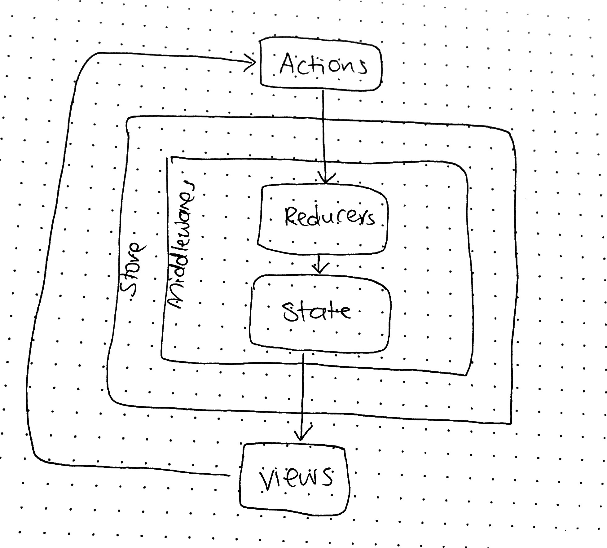

# LAB - 34

## Redux - Part 1

### Author: Joanna Arroyo

### Links and Resources
* [submission PR](https://github.com/joanna-401-advanced-javascript/lab-34-redux/pull/1)
* [travis](https://travis-ci.com/joanna-401-advanced-javascript/lab-34-redux)

#### Documentation
* [styleguide](http://xyz.com) (React assignments)

### Modules
#### `index.js` `App.js` `create-store.js` `main-reducer.js` `author-reducer.js`
##### Exported Values and Methods

###### `App.js -> React class component`
###### `create-store.js -> React functional component`
###### `main-reducer.js -> React functional component`
###### `author-reducer.js -> React functional component`

### Setup

#### Running the app
* `npm start`
  
#### Tests
* Unit tests: `npm run test`
* Lint tests: `npm run lint`

#### UML
